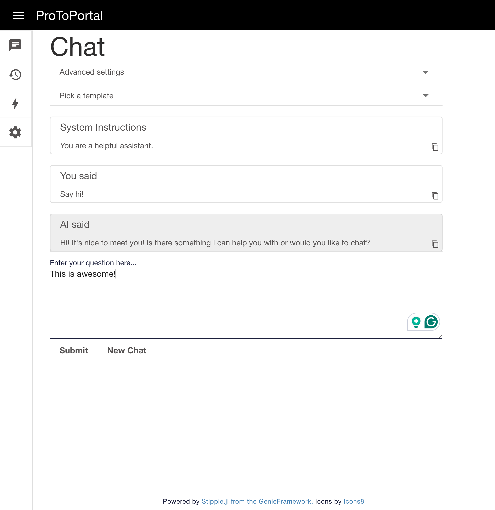
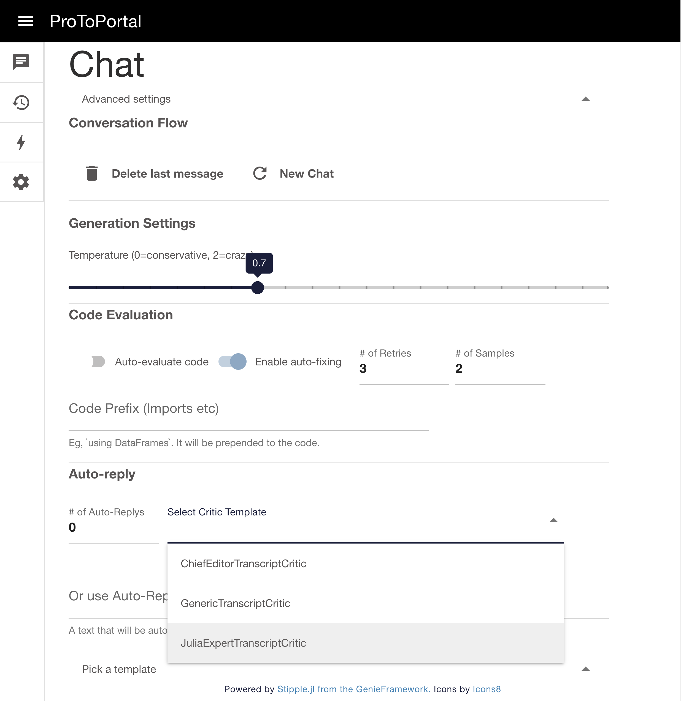

# ProToPortal.jl 

[](https://svilupp.github.io/ProToPortal.jl/stable/) 
[](https://svilupp.github.io/ProToPortal.jl/dev/) 
[](https://github.com/svilupp/ProToPortal.jl/actions/workflows/CI.yml?query=branch%3Amain)
[](https://codecov.io/gh/svilupp/ProToPortal.jl)
[](https://github.com/JuliaTesting/Aqua.jl)
[](https://github.com/SciML/SciMLStyle)

Welcome to **ProToPortal**, your portal to the magic of [PromptingTools.jl](https://github.com/svilupp/PromptingTools.jl)! ProToPortal is a personal project designed to enhance productivity, potentially yours too!

Given it's a UI-rich application, it will contain many bugs I'm unaware of—let me know! 

Scroll to the bottom to see some screenshots.

> [!WARNING]
> This application is still in development. Use at your own risk.

## Getting Started

This guide assumes that you have already set up PromptingTools.jl! At the very least, you need to have `OPENAI_API_KEY` set in your environment.

1. Clone the repository
2. Run the following command to install the necessary dependencies:

```julia
using Pkg; Pkg.activate("."); Pkg.instantiate(".")
```

3. Launch the GUI

```julia
# as a quick hack if you don't have your environment variables set up, run the below line with your OpenAI key
# ENV["OPENAI_API_KEY"] = "<your_openai_api_key>"
include("main.jl")
```

Then head to your browser and go to [http://127.0.0.1:8000](http://127.0.0.1:8000) to see the app.

For the purists: simply run `julia --project -t auto main.jl` in your terminal (once installed)!

How to start? Type `Say hi!` in the question box on the Chat tab and click Submit (or press CTRL+ENTER).

## Motivation

Imagine you're walking your dog and suddenly come up with a brilliant idea for a code snippet you need urgently. 

Using ChatGPT on your phone is feasible, but slow and cumbersome—typing out or dictating a precise prompt can be a real hassle, not to mention you can't close the app or run the code to see if it works. 

Enter **ProToPortal**: Select the JuliaExpertAsk template, use speech-to-text on your phone to dictate your needs, enable auto-fixing with Monte-Carlo Tree Search (`airetry!`), and watch as your phone processes 6 iterations of the code before ChatGPT generates its first response!

## Key Highlights

- **Accessible Anywhere**: Use it on any device—laptop, phone, etc.—with numerous prompt templates designed to save your keystrokes.
- **Code Evaluation and Fixing**: The only GUI that lets you evaluate and fix your Julia code directly, saving you from the hassle of copy-pasting.
- **Automatic Replies**: Automate standard replies to refine responses, either through fixed messages or critic templates mimicking a separate agent.

## Features by Tab

### Login Page
- Comes with a simple login if you want to deploy it (Fly.io works like a charm!)
- Ignore the password when deploying locally (enter an empty password).

### Chat Tab
- **Advanced Settings**:
  - Rewind conversations by deleting messages you dislike or to restart the conversation.
  - Control creativity with model temperature settings.
  - Enable code evaluation (`AICode`) and auto-fixing using advanced algorithms like `airetry!` and Monte-Carlo Tree search.
  - Automate replies with pre-configured templates (~critic agents) or custom messages.

- **Templates**:
  - Begin conversations from a template, opening new input fields interpolated into text variables.
  - Add your templates by placing them in the `templates/` folder for automatic loading.

- **Chat**:
  - Submit your question by clicking "Submit" or via CTRL+ENTER.
  - Edit any message in the conversation (simply click on it and make a change).
  - Delete unwanted messages with ease (accidental deletions made difficult by hiding the button in the "Advanced Settings").
  - Copy the text of any message (see top right corner icon).
  - Start "new chat" with conversations automatically saved both on disk and in history.

### History Tab
- Browse and load past conversations with a simple click.
- Fork past conversations for continued exploration without altering the original history.
- View the current session or reload to fetch all saved conversations.

### Templates Tab
- Explore all available templates with previews and metadata to select the most suitable one.
- Search functionality for quick filtering by partial names or keywords.

### Configuration Tab
- Change the default model or add new ones from PromptingTools.
- Modify the default system prompt used when not employing a template.

And rich logging in the REPL to see what the GUI is doing under the hood!

## Screenshots

Very simple chat interface, easy to use on the phone!


Many templates are available, allowing you to save keystrokes.


Advanced settings - evaluate code, automatically critique or fix your Julia code.


## Alternatives

ProToPortal is a simple personal project and it cannot compete with established LLM GUIs! 

If you're looking for more robust software, consider the following tools:
- Open Webui: [https://github.com/open-webui/open-webui](https://github.com/open-webui/open-webui)
- Oobabooga's text generation webui: [https://github.com/oobabooga/text-generation-webui](https://github.com/oobabooga/text-generation-webui)
- Simple server in llama.cpp (for the purists)

## Contributing

Contributions are what make the open-source community such an amazing place to learn, inspire, and create. Any contributions you make are **greatly appreciated**. Please open an issue first, because this is first and foremost a simple tool to interact with LLMs on-the-go.

## License

Distributed under the MIT License. See `LICENSE` for more information.

## Acknowledgments

This project would not be possible without the amazing [Stipple.jl](https://github.com/GenieFramework/Stipple.jl) from the [Genie.jl](https://github.com/GenieFramework/Genie.jl) family! It's just a Stipple.jl wrapper around PromptingTools.jl.

